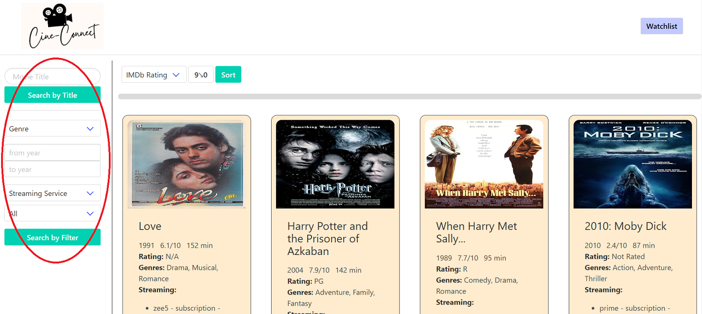
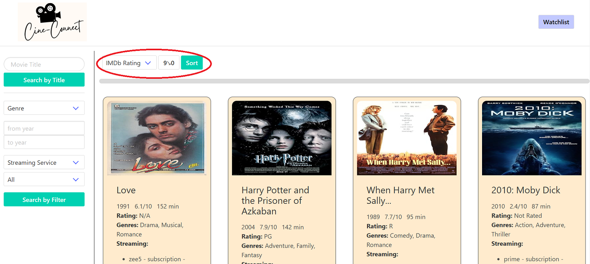
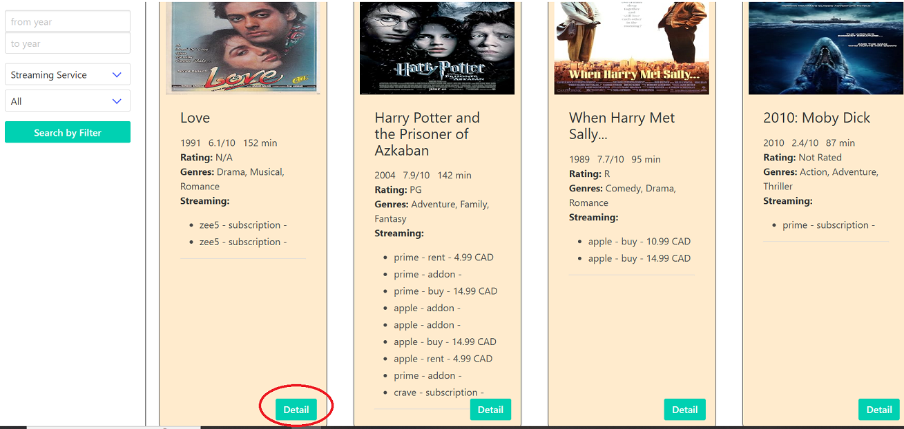
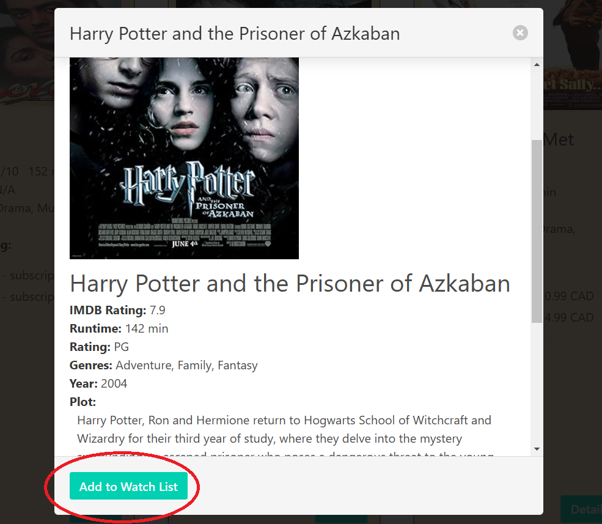

# CineConnect

## Description

CineConnect is your go-to platform for effortlessly searching movies and discovering their availability across various streaming services. With CineConnect, you can make informed decisions about what to watch by accessing essential information such as ratings and other details. Say goodbye to endless scrolling through different apps and websites - CineConnect simplifies the process, ensuring you spend less time searching and more time enjoying your favorite films.

## Usage

Visit [CineConnect](https://ehsanh2001.github.io/CineConnect/index.html)

You can use the left panel to search based on the movie title or by applying various filters.

<!--  -->

For sorting, you can use the panel at the top to sort movies based on the release year or IMDb rating in ascending/descending order.

To add a movie to your watchlist, first, click on the "Detail" button on a movie card.

And in the displayed dialog, you can view more details about the movie and add it to your watchlist.

## Credit

[Bulma](https://bulma.io/) CSS Framework.

## Contributors

-   [Ehsan Hosseini](https://github.com/ehsanh2001)
-   [Udit Sachdeva](https://github.com/usachdeva)
-   [Alexis Brown-Renshaw](https://github.com/KatLeviathan)
-   [Preeya Laxman](https://github.com/preeya777)
-   [Justin Morris](https://github.com/jmorris38)
-   [Hussein Moussa](https://github.com/hussein1322)
-   [Shayna Sammy](https://github.com/shaynanicole1)
